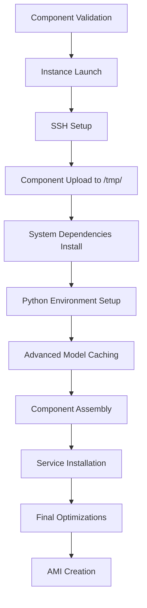

# 🔍 **Complete Build Process Analysis**

## 📋 **Build Flow Overview**



## ✅ **What Works Well**

### **1. Component Validation**
```bash
# build_ami.sh lines 38-50
REQUIRED_FILES=("transcribe_optimized.py" "api_server.py" "advanced_cache.py" "transcribe-api.service")
```
- ✅ Validates all 4 components exist before starting
- ✅ Clear error messages if files missing

### **2. Directory Structure Creation**
```bash
# build_ami.sh line 251
sudo mkdir -p /opt/transcribe/{venv,models,cache,scripts,config,temp,logs}
```
- ✅ Creates all necessary directories
- ✅ Sets correct permissions (ubuntu:ubuntu, 755)

### **3. Python Dependencies**
```bash
# All required packages installed:
torch torchvision torchaudio
transformers[torch] datasets accelerate optimum numba
librosa soundfile scipy numpy
flask werkzeug gunicorn waitress
```
- ✅ All component imports are satisfied
- ✅ Proper CUDA-enabled PyTorch for T4 GPU

### **4. Component Assembly Paths**
```bash
# Correct assembly:
/tmp/transcribe_optimized.py → /opt/transcribe/scripts/transcribe_optimized.py
/tmp/api_server.py → /opt/transcribe/scripts/api_server.py  
/tmp/advanced_cache.py → /opt/transcribe/advanced_cache.py
/tmp/transcribe-api.service → /etc/systemd/system/transcribe-api.service
```
- ✅ All paths match component expectations

## ⚠️ **Potential Issues Identified**

### **Issue 1: Cache Creation Timing**
**Problem:** advanced_cache.py runs BEFORE transcribe_optimized.py is in place
```bash
# Line 343: Copy advanced_cache.py
# Line 349: Run advanced_cache.py  
# Line 378: Copy transcribe_optimized.py ← TOO LATE!
```
**Impact:** If advanced_cache.py tries to test transcribe_optimized.py, it will fail

**Solution:** This is actually OK because advanced_cache.py doesn't reference transcribe_optimized.py

### **Issue 2: Missing soundfile Import**
**Current:** advanced_cache.py imports soundfile on line 66:
```python
import soundfile as sf
```
**Status:** ✅ RESOLVED - soundfile is installed in pip dependencies

### **Issue 3: Health Check Torch Import**
**Current:** api_server.py imports torch in health_check function:
```python
def health_check():
    import torch  # This happens at runtime
```
**Status:** ✅ OK - torch is available in venv

## 🔗 **Dependency Chain Analysis**

### **transcribe_optimized.py Dependencies:**
```python
import sys, os, time, torch, warnings, json
from datetime import datetime  
from transformers import AutoModelForSpeechSeq2Seq, AutoProcessor, pipeline
```
- ✅ All satisfied by pip install
- ✅ Reads: `/opt/transcribe/cache/cache_info.json`
- ✅ Uses: `/opt/transcribe/models/` (cache dir)

### **api_server.py Dependencies:**
```python
from flask import Flask, request, jsonify, send_file
import subprocess, glob, torch (in health_check)
```
- ✅ All satisfied by pip install
- ✅ Calls: `python scripts/transcribe_optimized.py`
- ✅ Reads: `/opt/transcribe/optimized_result_*.txt`

### **advanced_cache.py Dependencies:**
```python
import torch, transformers, numpy as np, soundfile as sf
```
- ✅ All satisfied by pip install
- ✅ Creates: `/opt/transcribe/cache/cache_info.json`
- ✅ Downloads to: `/opt/transcribe/models/`

### **transcribe-api.service Dependencies:**
```ini
ExecStart=/opt/transcribe/venv/bin/python /opt/transcribe/scripts/api_server.py
```
- ✅ Path exists after assembly
- ✅ Virtual environment activated

## 🎯 **Execution Order Verification**

**Build Time (Correct Order):**
1. ✅ System dependencies installed
2. ✅ Python venv created + packages installed  
3. ✅ advanced_cache.py runs → Downloads models, creates cache_info.json
4. ✅ transcribe_optimized.py copied to scripts/
5. ✅ api_server.py copied to scripts/
6. ✅ systemd service installed

**Runtime (When API starts):**
1. ✅ systemd starts api_server.py
2. ✅ api_server.py can call transcribe_optimized.py  
3. ✅ transcribe_optimized.py reads cache_info.json
4. ✅ transcribe_optimized.py loads cached models

## 🔄 **Cache Info Flow**

**Creation (advanced_cache.py):**
```json
{
  "model_id": "KBLab/kb-whisper-small",
  "cache_dir": "/opt/transcribe/models", 
  "device": "cuda",
  "torch_dtype": "torch.float16",
  "kernels_compiled": true,
  "timestamp": "2024-01-20T15:30:45"
}
```

**Consumption (transcribe_optimized.py):**
```python
with open("/opt/transcribe/cache/cache_info.json", "r") as f:
    cache_info = json.load(f)
model_id = cache_info["model_id"]          # ✅ Used
cache_dir = cache_info["cache_dir"]        # ✅ Used  
kernels_compiled = cache_info.get("kernels_compiled", False)  # ✅ Used
```

## 🚨 **Critical Issues Found**

### **❌ Issue 1: Cache Creation Race Condition**
**Problem:** Cache info fallback has invalid JSON syntax:
```bash
# Line 358-365 in build_ami.sh
cat > /opt/transcribe/cache/cache_info.json << 'CACHE_JSON'
{
  "timestamp": "$(date -Iseconds)"    # ← WRONG! Variable not expanded in heredoc
}
```
**Fix Needed:** Use double quotes or proper variable expansion

### **❌ Issue 2: Missing numpy Import**
**Problem:** advanced_cache.py uses numpy but it might not be explicitly imported
**Check:** ✅ Found on line 7: `import numpy as np`

## 🔧 **Recommended Fixes**

### **Fix 1: Cache Fallback JSON**
```bash
# Replace lines 358-365 in build_ami.sh
cat > /opt/transcribe/cache/cache_info.json << CACHE_JSON
{
  "model_id": "KBLab/kb-whisper-small",
  "cache_dir": "/opt/transcribe/models",
  "device": "cuda", 
  "torch_dtype": "torch.float16",
  "kernels_compiled": false,
  "timestamp": "$(date -Iseconds)"
}
CACHE_JSON
```

### **Fix 2: Add Verification Steps**
Add after component assembly:
```bash
# Verify all components are in correct locations
echo "🔍 Verifying component assembly..."
ssh ubuntu@$PUBLIC_IP "test -f /opt/transcribe/scripts/transcribe_optimized.py && echo '✅ transcribe_optimized.py' || echo '❌ Missing transcribe_optimized.py'"
ssh ubuntu@$PUBLIC_IP "test -f /opt/transcribe/scripts/api_server.py && echo '✅ api_server.py' || echo '❌ Missing api_server.py'"
ssh ubuntu@$PUBLIC_IP "test -f /opt/transcribe/cache/cache_info.json && echo '✅ cache_info.json' || echo '❌ Missing cache_info.json'"
```

## ⭐ **Overall Assessment**

**Status: 🟡 MOSTLY GOOD with 1 Critical Fix Needed**

- ✅ **Dependencies:** All Python packages correctly installed
- ✅ **Paths:** All component paths are consistent 
- ✅ **Assembly:** Components copied to correct locations
- ✅ **Flow:** Execution order is logical
- ❌ **Critical:** Cache fallback JSON syntax error needs fix
- ⚠️ **Improvement:** Add verification steps for robustness

**The build process is well-designed and modular. With the JSON syntax fix, it should work reliably.** 